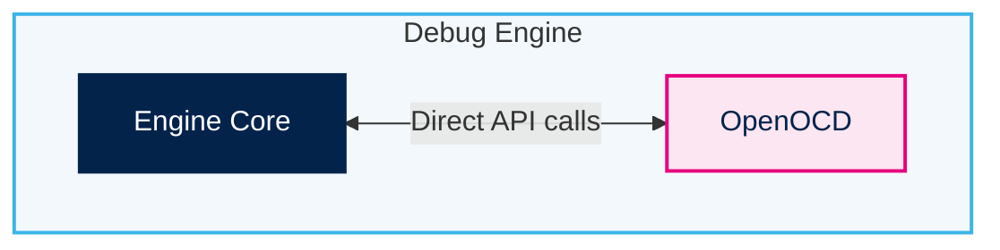
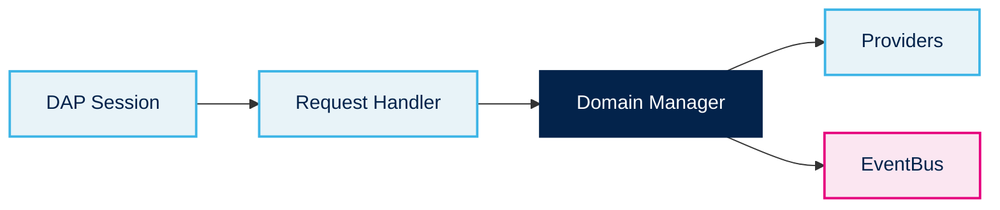
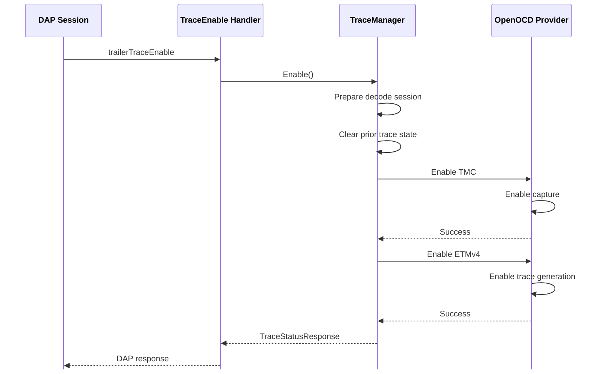
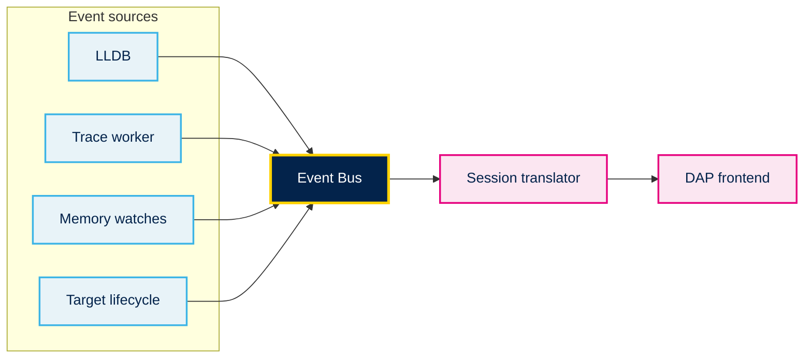
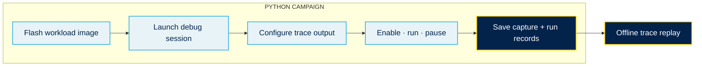

  

    

    

    

  

  

    
 PFE DEFENSE · STMICROELECTRONICS

    <h1 class="cover-title">Design &amp; Implementation of a Debugger with Instruction Trace Capabilities</h1>
    
Youssef <b>HASNAOUI</b>

    
26 September 2026

    

      Academic supervisor <b>Mrs. Faten SALEM</b>
      Professional supervisor <b>Mr. Mohamed HAMROUNI</b>
    

    

      Committee chair <b>Mrs. Samia HACHMI</b>
      Reporter <b>Mrs. Nourelhouda BEN YOUSEF</b>
    

    
STMicroelectronics representative <b>Mr. Chiheb MANAA</b>

  

---
layout: default
class: agenda-slide
---

# Agenda

  
01<b>Project Context</b>

  
02<b>Theoretical Concepts</b>

  
03<b>Forking OpenOCD</b>

  
04<b>Proposed Instruction Trace Pipeline</b>

  
05<b>Debug Engine Implementation</b>

  
06<b>Validation &amp; Results</b>

  
07<b>Demo</b>

  
08<b>Conclusion &amp; Perspective</b>

---
layout: section
section: "01 / PROJECT CONTEXT"
---

# Project Context

---
layout: default
---

PROJECT CONTEXT · HOST ORGANIZATION

  
<carbon-currency-dollar /><strong>$11.8B</strong><label>FY2025 revenue</label>

  
<carbon-group /><strong>50,000+</strong><label>employees worldwide</label>

  
<carbon-chemistry /><strong>9,500+</strong><label>people in R&amp;D</label>

  
<carbon-earth /><strong>200,000+</strong><label>customers globally</label>

  
<carbon-industry /><strong>14</strong><label>main manufacturing sites</label>

WHERE ST’S TECHNOLOGIES GO<b>Automotive</b><b>Industrial</b><b>Personal electronics</b>

---
layout: default
---

PROJECT CONTEXT · ST TUNIS

  

    
The Tunis site is an R&amp;D location where software, tools and product support meet.

    <ul class="clean-list">
      <li><i class="list-dot cyan"></i><b>Embedded software</b></li>
      <li><i class="list-dot yellow"></i><b>Tools</b></li>
      <li class="internship-team"><i class="list-dot pink"></i><b>Application &amp; Product Support Team</b><small>Customer technical support, documentation maintenance and support for new products during development.</small><em>MY INTERNSHIP TEAM</em></li>
    </ul>
  

  

---
layout: default
---

PROJECT CONTEXT

  
01
This project was hosted within <b>STMicroelectronics</b>.

  
02
It was carried out within the <b>Application &amp; Product Support team</b>, which provides technical support to customers.

  
03
The team needs the utmost visibility into microcontroller behavior, yet instruction trace is rarely available in its debugging workflow. <b>That gap motivates this project.</b>

---
layout: default
---

STATE OF THE ART

<table class="state-art-table vendor-compare-table">
  <thead><tr><th>Debugger</th><th>Supports instruction trace</th><th>Requires dedicated hardware probe</th><th>Offline decoding</th></tr></thead>
  <tbody>
    <tr><th>IAR</th><td>✓</td><td>✓</td><td>✗</td></tr>
    <tr><th>Keil</th><td>✓</td><td>✓</td><td>✗</td></tr>
    <tr><th>SEGGER</th><td>✓</td><td>✓</td><td>✗</td></tr>
    <tr><th>OpenOCD</th><td>✗</td><td>✗</td><td>✗</td></tr>
    <tr><th>pyOCD</th><td>✗</td><td>✗</td><td>✗</td></tr>
  </tbody>
</table>

---
layout: default
---

PROBLEM STATEMENT

<ul class="feedback-bullets problem-bullets">
  <li>Vendor IDEs tie instruction trace to proprietary probes.</li>
  <li>Trace analysis stays within the debug session.</li>
  <li>Open-source debuggers lack an end-to-end instruction-trace workflow.</li>
</ul>

---
layout: default
---

PROPOSED SOLUTION

<ul class="feedback-bullets">
  <li>Control trace components through OpenOCD.</li>
  <li>Decode captured trace offline.</li>
  <li>Develop a debugger with integrated trace analysis.</li>
</ul>

---
layout: default
---

OBJECTIVES

<ul class="feedback-bullets">
  <li>Implement trace-component drivers in OpenOCD.</li>
  <li>Capture on-chip trace without a dedicated trace probe.</li>
  <li>Build an offline trace-analysis pipeline.</li>
  <li>Deliver a debugger that integrates the instruction-trace analysis pipeline.</li>
</ul>

---
layout: section
section: "02 / THEORETICAL CONCEPTS"
---

# Theoretical Concepts

---
layout: default
---

THEORETICAL CONTEXT · INSTRUCTION TRACE

  
<b>Instruction trace</b> is a hardware-generated record of a processor’s execution path as a program runs.

  

    

Captures changes such as branches and exceptions.

    

Preserves the ordered sequence of the processor’s execution path.

    

Can timestamp events to show when they occurred.

  

---
layout: default
---

THEORETICAL CONTEXT · DEBUG METHODS COMPARED

<table class="trace-compare-table">
  <thead><tr><th>Method</th><th>What you observe</th><th>Side effects</th></tr></thead>
  <tbody>
    <tr><th>Halt &amp; inspect</th><td>Register and memory state at a breakpoint</td><td>Stops program execution</td></tr>
    <tr><th>Instrumentation</th><td>Events added to the program by the developer</td><td>Increased firmware size and I/O contention</td></tr>
    <tr class="trace-row-highlight"><th>Instruction trace</th><td>Time-ordered sequence of executed instructions</td><td>None</td></tr>
  </tbody>
</table>

---
layout: default
---

TRACE COMPONENT · EMBEDDED TRACE MACROCELL

  
An Embedded Trace Macrocell (ETM) is hardware that monitors a processor’s execution and produces an instruction-trace stream.

  <ul class="etm-points">
    <li>Observes control flow as the processor executes.</li>
    <li>Emits trace information for changes such as branches and exceptions.</li>
    <li>Sends the trace stream to trace infrastructure for storage or output.</li>
  </ul>

---
layout: default
class: trace-access-slide
---

THEORETICAL CONTEXT · ACCESSING TRACE DATA

<table class="trace-route-table">
  <thead><tr><th>On-chip capture</th><th>Off-chip capture</th></tr></thead>
  <tbody>
    <tr>
      <td><ul class="trace-route-list"><li>No additional trace hardware</li><li>No trace-pin I/O bandwidth limit</li></ul></td>
      <td><ul class="trace-route-list"><li>Virtually unlimited trace storage</li></ul></td>
    </tr>
  </tbody>
</table>

---
layout: default
---

TRACE COMPONENT · TRACE MEMORY CONTROLLER

  
A Trace Memory Controller (TMC) is a trace sink that stores incoming trace data for later retrieval.

  <ul class="etm-points">
    <li>Receives routed trace data from trace sources.</li>
    <li>Stores trace in an on-chip buffer or system memory.</li>
    <li>Exposes captured trace data through a memory-mapped interface.</li>
  </ul>

---
layout: section
section: "03 / FORKING OPENOCD"
---

# Forking OpenOCD

---
layout: default
---

DEBUG ACCESS · OPENOCD

OpenOCD is open-source software that manages communication with a debug target and makes its capabilities available to other software. It provides three interfaces for controlling the target:

<ul class="openocd-interface-list">
  <li><b>API</b></li>
  <li><b>Script interface</b></li>
  <li><b>Remote protocol interface</b></li>
</ul>

---
layout: default
class: embed-openocd-slide
---

EMBEDDING OPENOCD

### Default · Standalone OpenOCD

OpenOCD runs separately and is controlled by a client through RSP or TCL.

### This project · Embedded OpenOCD

OpenOCD is embedded in the Debug Engine and controlled through direct API calls.

---
layout: default
---

TRACE SOURCE · ETMv4 MODULE

  
The ETMv4 extension adds named-component discovery, staged configuration and explicit enable/disable control to OpenOCD. Its register access is performed through the target’s debug access port.

  

    
<b>Discover</b><small>Identify ETMv4 instances and read architecture capabilities.</small>

    
<b>Configure</b><small>Stage trace ID and source options, then commit them to the component.</small>

    
<b>Control</b><small>Keep trace requested across run-state events; apply configuration and enable generation when the target resumes.</small>

  

---
layout: default
---

TRACE SINK · TMC MODULE

  
The TMC module exposes capture configuration and output selection. On a halt event, it checks the capture state, drains the selected buffer mode, and hands the result to its consumer.

  

    
01<b>Configure</b><small>Choose a supported TMC mode and its buffer options.</small>

    
02<b>Extract on halt</b><small>Read captured words through the TMC FIFO data register after capture stops.</small>

    
03<b>Deliver capture</b><small>Send a frame-aligned sync barrier, then the captured bytes.</small>

  

  
<carbon-data-share />
<b>The callback carries the capture</b><small>Consumers can write it to a file, stream it over the trace service, or pass it to the decoding pipeline.</small>

<b>FILE</b>·<b>SOCKET</b>·<b>DECODER</b>

---
layout: section
section: "04 / PROPOSED INSTRUCTION TRACE PIPELINE"
---

# Proposed Instruction Trace Pipeline

---
layout: default
class: capture-pipeline-slide
---

01 · GENERATION &amp; CAPTURE

  

    <small class="capture-overline">PROCESSOR</small>
    <b>M-profile core</b>
    Executes the program
  

  
<Arrow x1="0" y1="50" x2="64" y2="50" color="#3cb4e6" width="3" />

  

    <small class="capture-overline">TRACE SOURCE</small>
    <b>ETMv4</b>
    Generates instruction trace
    <em>GENERATION ENABLED</em>
  

  
<Arrow x1="0" y1="50" x2="64" y2="50" color="#e6007e" width="3" />

  

    <b>Trace Infrastructure</b>
    Routes the stream to the sink
  

  
<Arrow x1="0" y1="50" x2="64" y2="50" color="#3cb4e6" width="3" />

  

    <small class="capture-overline">TRACE SINK</small>
    <b>TMC</b>
    Formats and captures in its buffer
    <em>CAPTURE ACTIVE</em>
  

We enable ETM and TMC, configure both components, then run the program to generate and capture trace.

---
layout: default
---

02 · TRACE EXTRACTION

  

    <b class="mcu-trace-title">MCU</b>
    

      

        
<i></i><i></i><i></i><i></i><i></i><i></i>

        <b>FIFO</b>
      

      
      
<b>TMC</b>

    

  

  
<Arrow x1="186" y1="40" x2="18" y2="40" color="#71869a" width="3" />

  
<carbon-laptop /><b>Host computer</b>

<ul class="extract-steps">
  <li>Trace data is accessible through the RRD (RAM Read Data) register.</li>
  <li>Repeated RRD reads retrieve successive FIFO data until the FIFO is empty.</li>
</ul>

---
layout: default
---

03 · TRACE DECODING

We are able to decode the saved capture without needing the target to be connected. OpenCSD is configured with the trace protocol, the ETM register values and the formatter settings and produces higher-level trace elements.

  
<carbon-document /><b>Captured Trace bytes</b>
+
  
<carbon-settings /><b>Firmware Image & ETM Identification Registers</b>
<Arrow x1="2" y1="13" x2="29" y2="13" color="#ffd200" width="2" />
  
<carbon-list /><b>Trace elements</b>

---
layout: default
---

04 · SOURCE CORRELATION · RECONSTRUCTION

The decoder reports ranges of executed addresses rather than a row for every instruction. The program image supplies the instruction bytes, so disassembly expands each range into its exact instruction sequence while preserving control-flow order.

  
DECODED Element<b>INSTRUNCTION_RANGE(0x100, 0x108)</b>

  
<Arrow x1="2" y1="13" x2="34" y2="13" color="#ffd200" width="2" />

  
ELF LOAD SEGMENTS
<code>push {r4, lr} mov r4, r0 cmp r0, #1 bne.n 0x080012AA</code>

  
<Arrow x1="2" y1="13" x2="34" y2="13" color="#ffd200" width="2" />

  
ORDERED INSTRUCTION STREAM<b>4 reconstructed instructions</b><small>chronological · instruction by instruction</small>

---
layout: default
---

05 · SOURCE CORRELATION · DWARF

Once the instruction sequence is reconstructed, DWARF debug information maps each address to its source location and inline-call chain. The result connects machine-level execution back to the code the developer recognizes.

  
<small>RECONSTRUCTED FLOW</small>
<b>0x080012A0</b><code>push {r4, lr}</code>

<b>0x080012A2</b><code>mov r4, r0</code>

<b>0x080012A4</b><code>cmp r0, #1</code>

<b>0x080012A6</b><code>bne.n 0x080012AA</code>

  
DWARF LOOKUP <Arrow x1="4" y1="13" x2="58" y2="13" color="#ffd200" width="2" />

  
<small>SOURCE + INLINE CHAIN</small>
<b>motor.c : 42</b>if (ready) {

<b>motor.c : 43</b>enable_motor();

<b>control.c : 18</b>set_output(true);

inline frames kept

---
layout: default
---

06 · SOURCE CORRELATION · USEFUL VIEWS

The same chronological record can be explored at three levels of detail: individual instructions, source-line blocks, or function blocks.

  
I
<b>Instruction view</b><small>One row per reconstructed instruction.</small>

0x080012A0<code>push {r4, lr}</code><em>motor.c:42</em>

  
GROUP

  
L
<b>Line blocks</b><small>Adjacent instructions mapped to the same source context.</small>

12 instr<code>motor.c:42</code><em>3 occurrences</em>

  
GROUP

  
F
<b>Function blocks</b><small>Consecutive line blocks grouped by function.</small>

4 functions<code>motor_control()</code><em>chronological</em>

---
layout: default
---

IMPLEMENTATION SNAPSHOT · INSTRUCTION VIEW

<figure class="ui-snapshot-single">
  
  <figcaption><b>Trace instructions</b>Addresses, disassembly and correlated source locations.</figcaption>
</figure>

---
layout: default
---

IMPLEMENTATION SNAPSHOT · FUNCTION VIEW

<figure class="ui-snapshot-single">
  
  <figcaption><b>Trace by function</b>Chronological function blocks for a higher-level view.</figcaption>
</figure>

---
layout: section
section: "05 / DEBUG ENGINE IMPLEMENTATION"
---

# Debug Engine Implementation

---
layout: default
class: debug-architecture-slide
---

ARCHITECTURE

  

    <b class="architecture-panel-title">DAP Interface</b>
    

      
Transport

      
      
Orchestrator

      
      
Request Queue

      
      
Request Handlers

    

    
Session Translator

  

  
requests / events<i></i>

  

    <b class="architecture-panel-title">Debug Context</b>
    

      

        

          
          
          
          
          Domain Managers
        

      

      

        <b>Context Services</b>
        

          EventBusLLDB ProviderOpenOCD Provider
        

      

    

  

---
layout: default
class: domain-managers-slide
---

DOMAIN MANAGERS

Each request is routed to the manager responsible for that debugger domain. The manager coordinates provider work and publishes relevant session updates through the EventBus.

  <b>TraceManager</b>
  <ul>
    <li>Prepares the trace session</li>
    <li>Coordinates capture through OpenOCD</li>
    <li>Feeds captured data into analysis</li>
  </ul>

---
layout: default
class: provider-comparison-slide
---

PROVIDERS

  <table class="provider-table">
    <thead><tr><th>Provider</th><th>Responsibilities</th></tr></thead>
    <tbody>
      <tr><td><b>LLDB</b></td><td><ul><li>Execution control</li><li>Symbols</li><li>Registers</li><li>Memory</li><li>Breakpoints</li></ul></td></tr>
      <tr><td><b>OpenOCD</b></td><td><ul><li>Target access</li><li>Direct TCL commands</li><li>Trace component control</li></ul></td></tr>
      <tr><td><b>Device</b></td><td><ul><li>Device identity</li><li>Memory map</li><li>Peripheral descriptions</li></ul></td></tr>
      <tr><td><b>Trace</b></td><td><ul><li>ETM decode</li><li>Instruction reconstruction</li><li>Source mapping</li></ul></td></tr>
    </tbody>
  </table>

---
layout: default
class: trace-start-sequence-slide
---

TRACE START · REQUEST FLOW

---
layout: default
---

THREAD MODEL

  
READER
Read framed request
<Arrow x1="2" y1="12" x2="26" y2="12" color="#ffd200" width="2" />
Queue dispatch

  
DISPATCH
Validate request
<Arrow x1="2" y1="12" x2="26" y2="12" color="#ffd200" width="2" />
Call handler

  
WORKERS
Trace / watch work
<Arrow x1="2" y1="12" x2="26" y2="12" color="#ffd200" width="2" />
Publish event

---
layout: default
class: event-bus-slide
---

EVENT BUS

  

    
The Event Bus is a publish-subscribe registry that allows the debugger to support asynchronous events.

    <ul>
      <li>Components publish domain events to the Event Bus.</li>
      <li>The debugger session subscribes to receive those events.</li>
      <li>It translates them into frontend notifications, without requiring a request.</li>
    </ul>
  

---
layout: section
section: "06 / VALIDATION & RESULTS"
---

# Validation &amp; Results

---
layout: default
---

TEST PLATFORM · BOARD &amp; PROBE

  
NUCLEO-H7S3L8

  

    
A single board provides the target and the debug connection used for hardware validation.

    
<carbon-chip />
<b>Target board</b><small>NUCLEO-H7S3L8 · STM32H7S3L8</small>

    
<carbon-usb />
<b>On-board ST-LINK</b><small>Connects to the host over USB and to the MCU over SWD.</small>

    
<b>No external trace probe</b><small>The captured trace is read through the ordinary debug connection.</small>

  

---
layout: default
class: trace-infrastructure-slide
---

TEST PLATFORM · TRACE INFRASTRUCTURE

---
layout: default
class: validation-workloads-slide
---

VALIDATION · WORKLOADS

Six firmware images exercise different execution patterns on the target.

  
<b>W1</b><strong>Nested decisions</strong>

  
<b>W2</b><strong>Function-call chain</strong>

  
<b>W3</b><strong>Branch-heavy sorting</strong>

  
<b>W4</b><strong>Timer interrupt</strong>

  
<b>W5</b><strong>DMA transfer + idle wait</strong>

  
<b>W6</b><strong>Dense branch loop</strong>

---
layout: default
class: validation-layout-slide
---

VALIDATION · SOFTWARE LAYOUT

<ul class="validation-campaign-points">
  <li>The Python runner drives the project debugger over DAP and configures ETF output through OpenOCD.</li>
  <li>Each run saves the raw capture, trace events, status and run metadata.</li>
  <li>Workload, duration, trace options and repeat count are selected per campaign.</li>
</ul>

---
layout: default
---

RECONSTRUCTION VALIDATION

  

    
<b>LLDB single-step reference</b>
<i></i><i></i><i></i><i></i><i></i><i></i><i></i><i></i><i></i><i></i><i></i><i></i><i></i><i></i><i></i><i></i><i></i><i></i><i></i><i></i>

    
<strong>400 / 400</strong>addresses match

    
<b>Hardware trace reconstruction</b>
<i></i><i></i><i></i><i></i><i></i><i></i><i></i><i></i><i></i><i></i><i></i><i></i><i></i><i></i><i></i><i></i><i></i><i></i><i></i><i></i>

  

  
Same starting breakpoint · one interrupt-free workload

---
layout: default
---

VALIDATION · CAPTURE CHARACTERIZATION

  
Mean reconstructed instructions in one full buffer
<i>0</i><i>1,750</i><i>3,500</i><i>5,250</i><i>7,000</i>

  
<b>W2 Calls</b>
<i style="--density:24.4%"></i>
<strong>1,710</strong>

  
<b>W5 DMA</b>
<i style="--density:32.3%"></i>
<strong>2,261</strong>

  
<b>W4 Interrupt</b>
<i style="--density:41.7%"></i>
<strong>2,922</strong>

  
<b>W1 Baseline</b>
<i style="--density:65.4%"></i>
<strong>4,579</strong>

  
<b>W3 Branches</b>
<i style="--density:74.6%"></i>
<strong>5,222</strong>

  
<b>W6 Dense loop</b>
<i style="--density:88.5%"></i>
<strong>6,193</strong>

---
layout: default
---

VALIDATION · PIPELINE OPTIMIZATION

  

    <section class="optimization-lane optimization-before"><h2>Before</h2>
<b>Trace records</b><i></i><b>Reconstruct instructions</b><i></i><b>Build function blocks<small>reconstructed again</small></b>
</section>
    <section class="optimization-lane optimization-after"><h2>After</h2>
<b>Reconstructed instructions</b><i></i><b>Build function blocks<small>reuse existing instructions</small></b>
</section>
  

  
<strong>54–61%</strong>less time in function-block transformation<b>Instruction, block and gap counts remained unchanged.</b>

  
Measured on three workloads using identical captures · offline host processing

---
layout: section
section: "07 / DEMO"
---

# Demo

---
layout: default
class: demo-slide
---

  <SlidevVideo controls class="demo-video">
    <source src="/assets/debugger_demo.mp4" type="video/mp4" />
    Your browser cannot play this video.
  </SlidevVideo>

---
layout: section
section: "08 / CONCLUSION & PERSPECTIVE"
---

# Conclusion &amp; Perspective

---
layout: default
---

CONCLUSION

<ul class="conclusion-points">
  <li>Extended OpenOCD with ETMv4 and TMC modules for trace configuration and capture.</li>
  <li>Built an offline instruction-trace decoding and source-correlation pipeline.</li>
  <li>Integrated trace control and analysis into the Debug Engine.</li>
  <li>Exposed trace capture and analysis through a unified debugger workflow.</li>
  <li>Kept the implementation device-agnostic, with hardware-specific details confined to target configuration.</li>
</ul>

---
layout: default
---

PERSPECTIVE

  
<carbon-network-4 /><small>01</small><b>Multi-core tracing</b>
Correlate execution across processors and reason about cross-core causality.

  
<carbon-filter /><small>02</small><b>Trace filtering</b>
Capture only selected address ranges, events or execution contexts.

  
<carbon-chart-line /><small>03</small><b>Profiling</b>
Turn execution history into time, call-graph and hot-path analysis.

---
layout: center
class: thank-you-slide
---

THANK YOU

Youssef HASNAOUI <i>·</i> 26 September 2026

Design &amp; Implementation of a Debugger with <b>Instruction Trace Capabilities</b>

